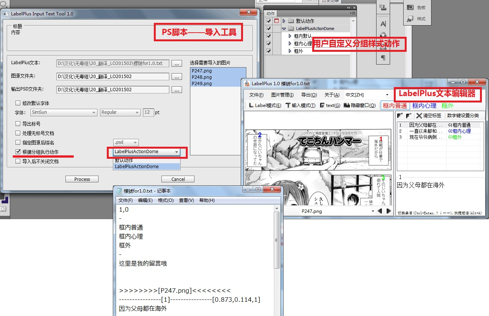

# LabelPlus PS-Script



## 概述

LabelPlus是一个用于图片翻译的工具包，本工程是其中的Photoshop文本导入工具，它读入翻译文本，并将文本逐条添加到PSD档中。

脚本用到的开源项目：
* [xtools(BSD license)](http://ps-scripts.sourceforge.net/xtools.html)中部分工具函数及UI框架
* [JSON Action Manager](http://www.tonton-pixel.com/json-photoshop-scripting/json-action-manager/index.html)中的JSON解析库

功能一览：

* 解析LabelPlus文本 创建对应文本图层
* 允许选择性导入部分文件、分组
* 允许更换图源：可使用不同尺寸、可根据顺序自动匹配文件名（图片顺序、数量必须相同）、可替换图源后缀名
* 自定义自动替换文本规则（如自动将`！？`替换为`!?`）
* 格式设置：字体、字号、行距、文本方向
* 可设置自定义动作：每导入一段文字后，执行动作；打开、关闭文档时执行动作
* 根据标号位置自动涂白（实验功能）

## 开发方法

### requirement
* typescript
* python

```
$ sudo apt install python nodejs
$ sudo npm install -g typescript yarn
```

### build

```
$ cd PS-Script
$ yarn install
$ ./build.sh
```
